# Crimson Dragon Hot Pot — Portfolio Showcase

A full-featured Flutter food delivery app built from scratch, covering the complete user journey from onboarding to order tracking. Every screen is fully navigable with 24 routes, a custom design system, and production-ready UI patterns.

**GitHub:** https://github.com/TerraRome/Hot-Pot  
**Stack:** Flutter 3.41.3 · Dart 3.11.1 · GoRouter · Riverpod · Material 3  
**Platform:** Android & iOS

---

## Screenshots

### Capture Status

| # | Halaman | Route | Tipe | Status |
|---|---------|-------|------|--------|
| 01 | Splash | `/splash` | PNG | ⏳ |
| 02 | Onboarding | `/onboarding` | GIF | ✅ |
| 03 | Sign In | `/signin` | PNG | ✅ |
| 04 | OTP | `/otp` | PNG | ✅ |
| 05 | Home | `/` | PNG | ✅ |
| 06 | Search | `/search` | PNG | ✅ |
| 07 | Category Browse | `/category` | PNG | ✅ |
| 08 | Product Detail | `/product` | PNG | ⏳ |
| 09 | Cart | `/cart` | PNG | ⏳ |
| 10 | Checkout | `/checkout` | PNG | ⏳ |
| 11 | Order Tracking | `/tracking` | PNG | ✅ |
| 12 | Live Tracking | `/live-tracking` | PNG | ⏳ |
| 13 | Invoice | `/invoice` | PNG | ⏳ |
| 14 | Notifications | `/notifications` | GIF | ✅ |
| 15 | Profile | `/profile` | GIF | ✅ |
| 16 | Edit Profile | `/edit-profile` | GIF | ✅ |
| 17 | Saved Addresses | `/addresses` | PNG | ✅ |
| 18 | Payment Methods | `/payment-methods` | PNG | ✅ |
| 19 | Favourites | `/favourites` | PNG | ⏳ |
| 20 | My Reviews | `/reviews` | PNG | ⏳ |
| 21 | Promo Vouchers | `/promos` | PNG | ⏳ |
| 22 | Help & FAQ | `/faq` | GIF | ⏳ |
| 23 | Settings | `/settings` | GIF | ⏳ |
| 24 | Loyalty & Rewards | `/loyalty` | GIF | ⏳ |

---

### Auth & Onboarding

| Splash | Onboarding | Sign In | OTP |
|--------|-----------|---------|-----|
| 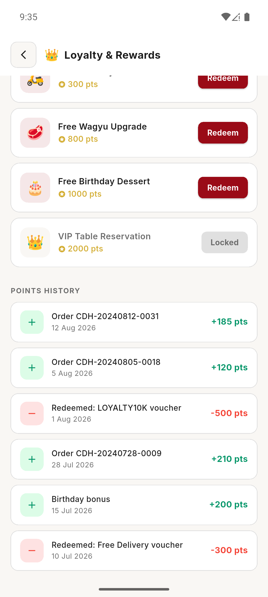 | 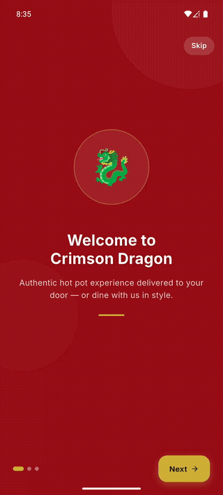 | 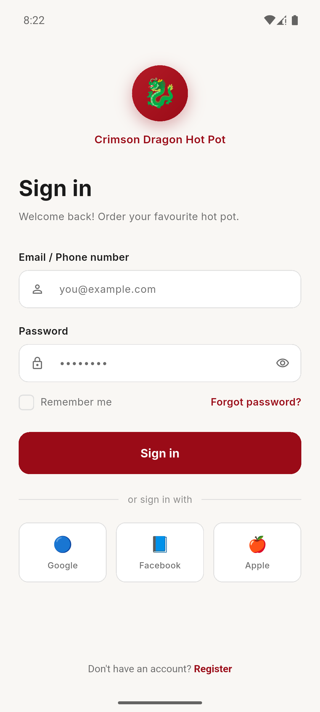 | 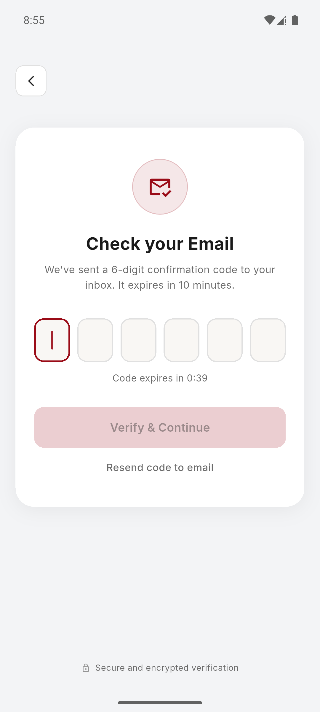 |

### Browse & Discovery

| Home | Search | Category Browse |
|------|--------|----------------|
| 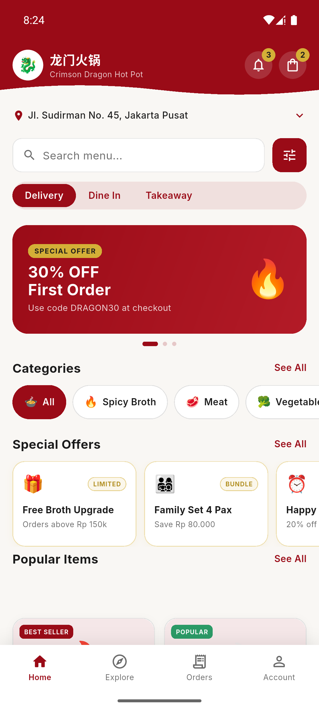 | 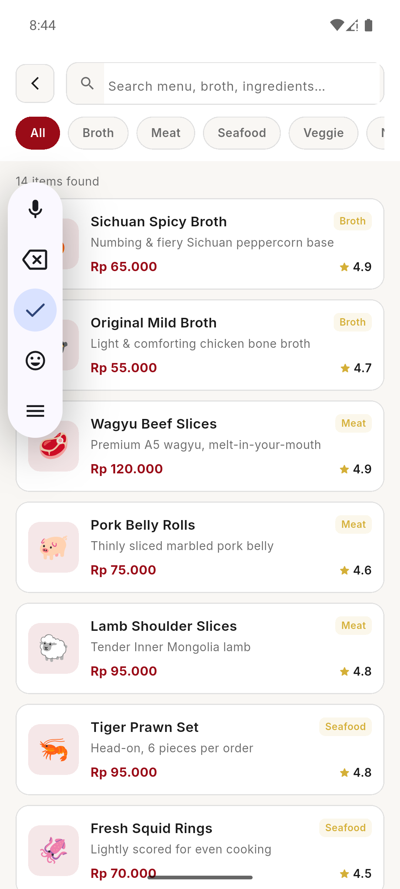 | 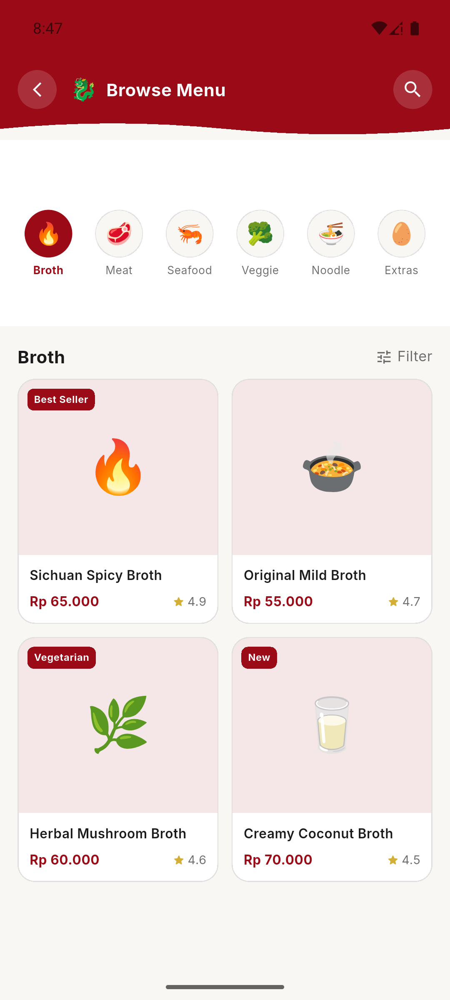 |

### Order Flow

| Product Detail | Cart | Checkout | Order Tracking |
|---------------|------|---------|---------------|
| 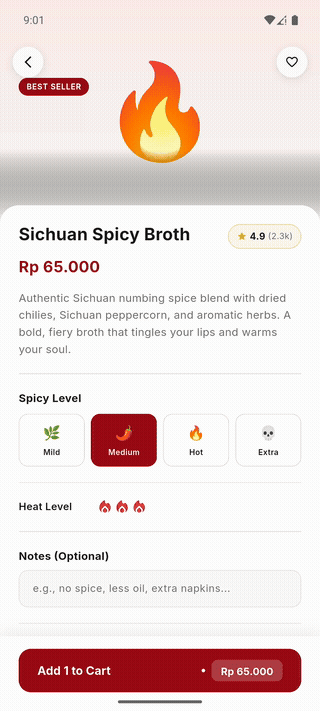 | 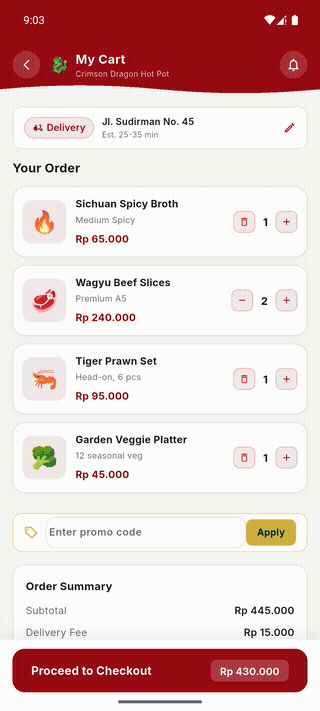 | 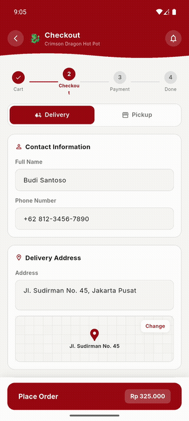 | 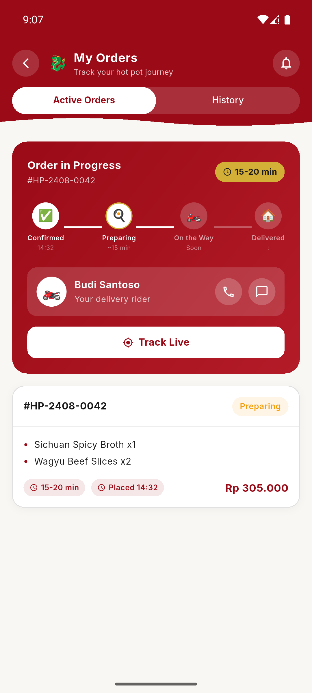 |

| Live Tracking | Invoice | Notifications |
|--------------|---------|--------------|
| 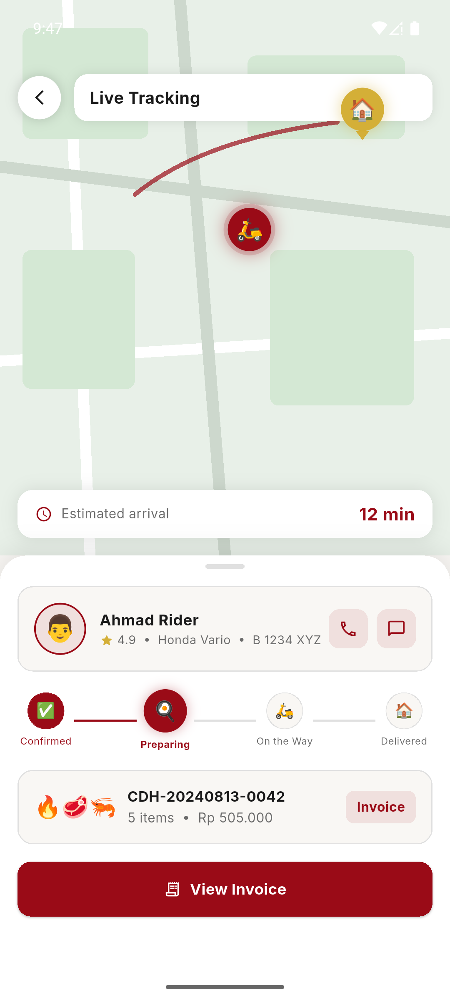 | 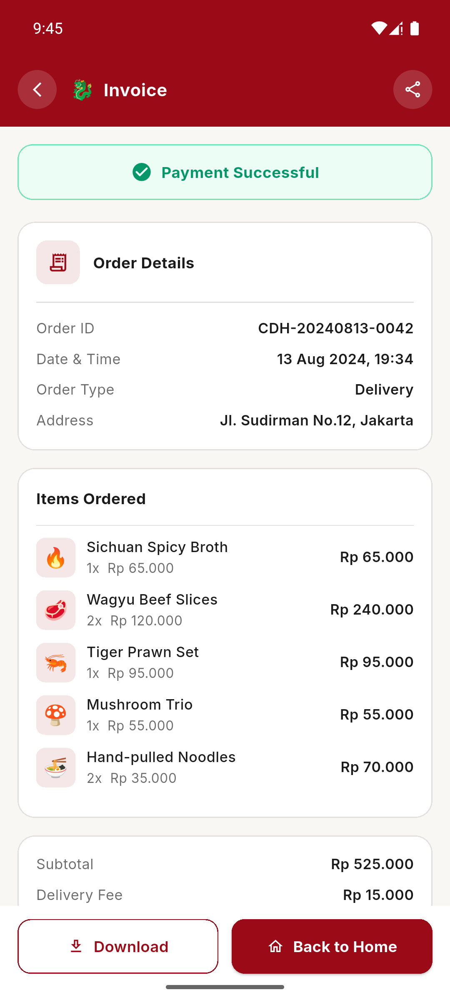 | 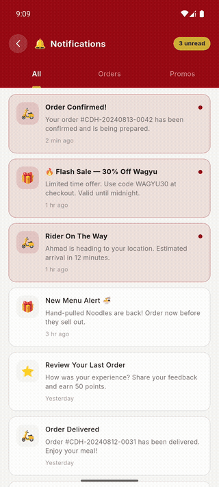 |

### Profile & Account

| Profile | Edit Profile | Saved Addresses | Payment Methods |
|---------|-------------|----------------|----------------|
| 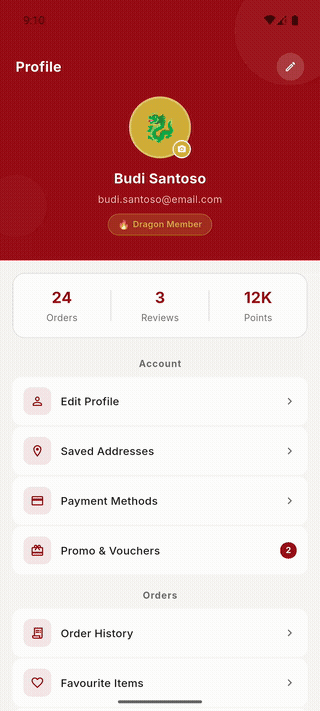 | 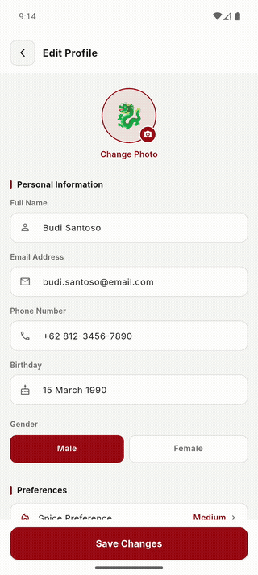 | 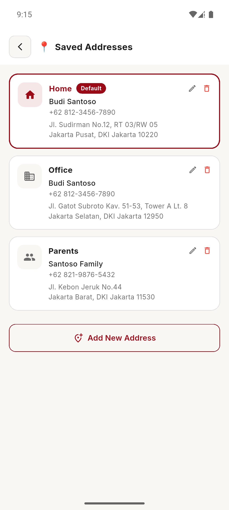 | 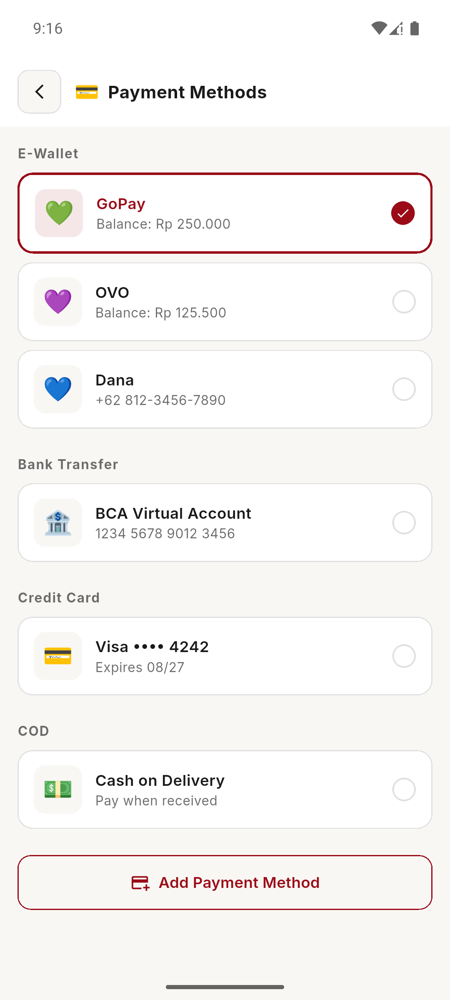 |

| Favourites | My Reviews | Promo & Vouchers | Help & FAQ |
|-----------|-----------|-----------------|-----------|
| 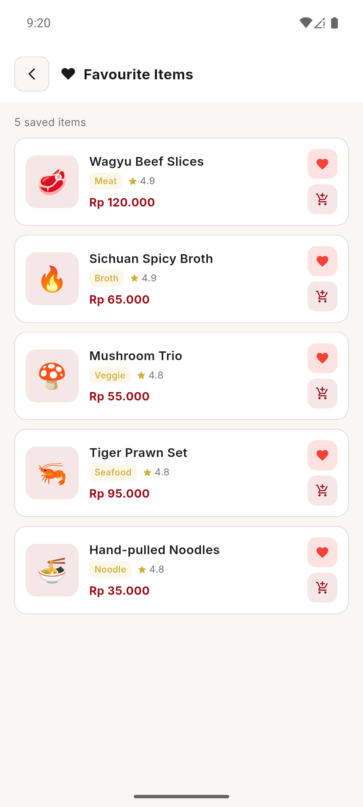 | 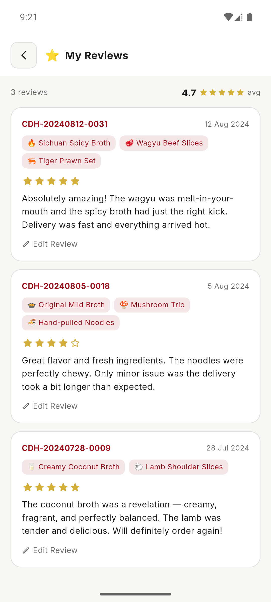 | 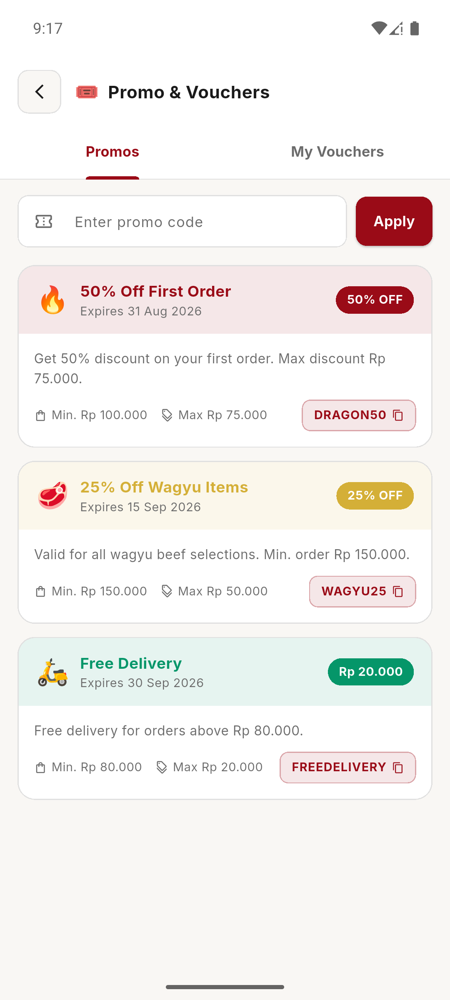 | 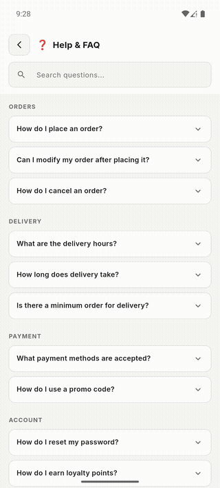 |

| Settings | Loyalty & Rewards |
|---------|------------------|
| 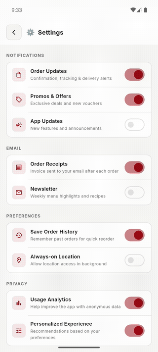 | 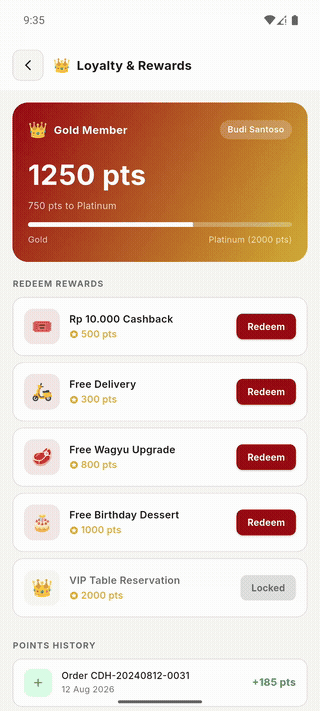 |

---

## What This Project Demonstrates

| Area | Details |
|------|---------|
| UI/UX Engineering | 24 fully navigable screens, consistent design system, pixel-level polish |
| State Management | Riverpod architecture, local state with StatefulWidget where appropriate |
| Navigation | GoRouter with typed route args, deep linking, push/pop stack |
| Custom Painting | `CustomPainter` animated map on Live Tracking screen |
| Animations | Hero transitions, AnimatedContainer, pulsing markers, dot indicators |
| Form Handling | Date pickers, OTP input, spicy level selector, qty stepper, gender picker |
| Design System | Custom tokens (crimson red + gold), Material 3 theming, dark/light ready |
| Code Architecture | Feature-first folder structure, clean separation of concerns |

---

## App Flow Overview

```
Splash → Onboarding (3 slides) → Sign In → OTP Verification
    └─→ Home
          ├─→ Search (live filter)
          ├─→ Category Browse
          ├─→ Product Detail → Cart → Checkout → Order Tracking
          │                                           └─→ Live Tracking Map
          │                                           └─→ Invoice
          ├─→ Notifications (3-tab)
          └─→ Profile
                ├─→ Edit Profile
                ├─→ Saved Addresses
                ├─→ Payment Methods
                ├─→ Favourite Items
                ├─→ My Reviews
                ├─→ Promo & Vouchers
                ├─→ Help & FAQ
                ├─→ Settings
                └─→ Loyalty & Rewards
```

---

## Screens by Feature

### Authentication & Onboarding

**Splash Screen**
- Animated dragon logo with scale + fade entrance
- Gold shimmer divider, loading dots sequence
- Auto-navigates to Onboarding on first launch

**Onboarding** (3 slides)
- PageView with animated dot indicators
- Skip button + Get Started CTA
- Smooth slide transitions between screens

**Sign In**
- Email/phone + password with social login (Google, Facebook, Apple)
- Remember me toggle, "Forgot Password" link
- Navigates to OTP after login

**OTP Verification**
- 6-box individual character input with auto-advance
- 60-second countdown timer with resend
- Auto-verifies when all 6 digits filled

---

### Browse & Discovery

**Home**
- Auto-scrolling banner carousel
- Category filter chips (All / Broth / Meat / Seafood / Veggie / Noodle)
- Special offers horizontal scroll
- Menu grid with emoji avatars, spicy badges, rating chips
- Header with notification bell (badge count 3) → Notifications

**Search**
- Live filtering as user types
- Category chips for quick filter
- Result list with emoji avatar, category badge, price, rating
- Empty state illustration

**Category Browse**
- 6-category icon grid with animated selection highlight
- Item grid with New / Hot / Limited tag badges
- Tap item → Product Detail with full args

---

### Order Flow

**Product Detail**
- Large emoji hero with gradient overlay
- Spicy level selector (0–3 chili icons, animated highlight)
- Quantity stepper with animated count
- Notes free-text field
- Related items horizontal scroll
- Add to Cart CTA with price

**Cart**
- Item rows with qty stepper + remove
- Promo code input with Apply button
- Special instructions text area
- Order summary (subtotal, delivery fee, discount, total)
- Checkout CTA

**Checkout**
- Delivery / Pickup toggle (conditional delivery form)
- Contact name + phone fields
- Map preview widget
- Time slot picker (delivery only)
- Payment method selector
- Place Order CTA

---

### Orders & Tracking

**Order Tracking**
- Active orders tab: progress steps (Confirmed → Preparing → On The Way → Delivered)
- Rider contact card with call / chat buttons
- Order history tab with reorder button
- "Track Live" button → Live Tracking

**Live Tracking**
- Custom `CustomPainter` animated map with road paths
- Pulsing rider marker with position animation
- ETA chip + progress steps overlay
- Rider info card (name, rating, phone)
- Invoice button → Invoice page

**Invoice**
- Order ID, date, payment method badge
- Items list with emoji + qty + price
- Price summary breakdown
- Payment status badge (Paid / Pending)
- Download & Back to Home actions

---

### Profile & Account

**Profile**
- Stats row: Orders / Reviews / Points
- Fully navigable menu (12 items across 4 sections)
- Dark mode + notifications toggle
- Sign out → back to Sign In

**Edit Profile**
- Full name, email, phone fields
- Birthday with date picker dialog
- Gender segmented picker
- Dietary preferences section (toggle chips)
- Save changes CTA

**Saved Addresses**
- Address cards with icon (Home / Office / etc.)
- Select default address (animated border highlight)
- Edit + delete per card
- Add New Address button

**Payment Methods**
- Grouped by type: E-Wallet / Bank Transfer / Credit Card / COD
- Animated selection with radio indicator
- Add Payment Method button

**Favourite Items**
- Item cards with emoji, category badge, rating, price
- Remove from favourites (heart button)
- Add to cart shortcut
- Tap → Product Detail
- Empty state with Browse Menu CTA

**My Reviews**
- Average rating summary header
- Review cards: order ID, date, ordered items chips, star rating, comment
- Edit Review button per card

**Promo & Vouchers**
- 2-tab: Available Promos / My Vouchers
- Promo code input + Apply button
- Promo cards with color-coded header band, discount badge, copy code chip
- Min. order + max discount info per promo

**Help & FAQ**
- Search bar with live filter
- Accordion items grouped by category (Orders / Delivery / Payment / Account)
- Animated expand/collapse per item
- Contact support card: Live Chat + Email Us buttons

**Settings**
- Notification toggles: Order Updates, Promos, App Updates
- Email toggles: Receipts, Newsletter
- Preference toggles: Order History, Always-on Location
- Privacy toggles: Analytics, Personalization
- Account actions: Download Data, Change Password, Delete Account (with confirmation dialog)
- App version footer

**Loyalty & Rewards**
- Points card with gradient (crimson → gold), tier badge, progress bar to next tier
- Reward cards: locked/unlocked state based on user points
- Redeem button (active only if points sufficient)
- Points history list (earn green / redeem red)

**Notifications**
- 3-tab view: All / Orders / Promos
- Unread badge on bell icon in home header
- Read / unread visual state on each card
- Notification type icons per category

---

## Design System

Custom-built design system: **Crimson Dragon Hot Pot**

```
Primary      #9A0B17  — Deep Crimson Red
Secondary    #D4AF37  — Antique Gold
Background   #F9F7F4  — Warm Cream
Surface      #FFFFFF  — Pure White
Font         Inter    — Regular / Medium / SemiBold / Bold
```

Applied consistently across all 24 screens:
- Spicy badge uses primary gradient
- Rating stars use secondary gold
- CTAs use primary red
- Category badges use secondary gold background
- All cards use surface white on warm cream background

---

## Technical Highlights

**GoRouter (24 routes)**  
All navigation uses typed route args — no raw Map passing. `ProductDetailArgs` and `InvoiceArgs` ensure compile-time safety across push/pop calls.

**Custom Painter — Live Tracking Map**  
The live tracking screen uses `CustomPainter` to draw an animated road network with a pulsing rider marker. No map SDK dependency — pure Flutter canvas.

**Overscroll Fix**  
A custom `_NoStretchScrollBehavior` is applied globally in `app.dart` to remove Android's stretch overscroll effect across all scroll views — consistent behavior on both platforms.

**Material 3 Theme**  
Full `ThemeData` setup with `CardThemeData`, `AppBarTheme`, `ElevatedButtonThemeData`, `InputDecorationTheme`, and `TabBarTheme` — no inline styling scattered across widgets.

**Feature-First Architecture**  
```
features/
  auth/
  home/
  menu/
  cart/
  checkout/
  orders/
  profile/
  notifications/
```
Each feature is self-contained with its own `presentation/pages/` and `presentation/widgets/` — ready to plug in a data layer.

---

## Project Stats

| Metric | Count |
|--------|-------|
| Total screens | 24 |
| Dart files | 30+ |
| Lines of code | ~7,000+ |
| Routes | 24 |
| Design tokens | 12 |
| Feature modules | 10 |

---

## Running Locally

```bash
git clone https://github.com/TerraRome/Hot-Pot.git
cd Hot-Pot
flutter pub get
flutter run
```

Requires Flutter 3.41.3+. Uses FVM — run `fvm flutter run` if FVM is installed.

---

## Related Docs

- [README.md](./README.md) — Technical documentation, routes table, project structure
- [FLOW.md](./FLOW.md) — Full business process flow diagram (11 sections)
